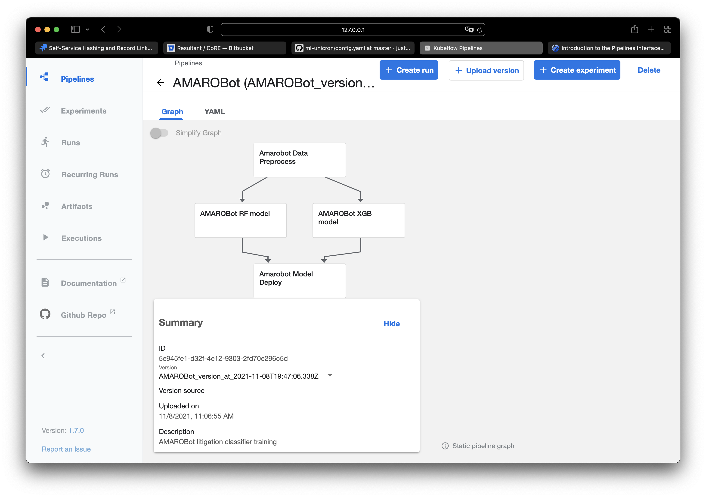
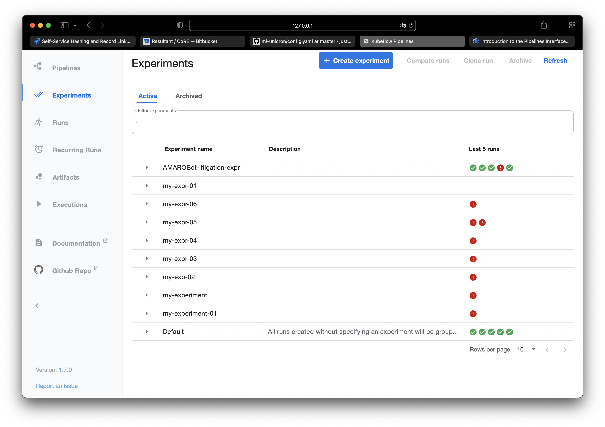
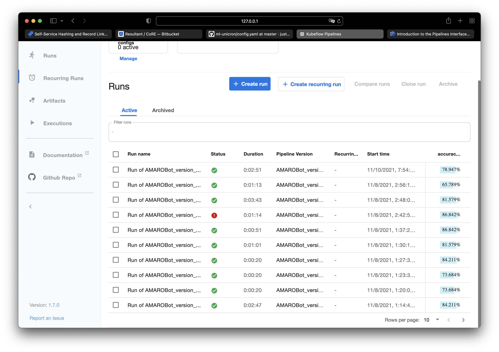

# Kubeflow Pipeline POC Memo

Author: Xing Yu
Date: Oct 22, 2021

## Resource Requirements
1. A Kubernetes cluster with [Kubeflow Pipeline](https://www.kubeflow.org/docs/components/pipelines/overview/pipelines-overview/) deployment.  
2. An image registry for storing containerized applications (e.g., Docker hub). The Kubernetes cluster should have access to the image registry.
3. A code repository for storing pipeline files and/or pipeline components.
4. Deployment frameworks such as [Kserve](https://github.com/kubeflow/kfserving) and [Seldon](https://www.seldon.io).

## Prerequisites of using Kubeflow pipelines.

### For System Admin
1. The admin should have knowledge of [Kubernetes](https://kubernetes.io) on the choosen Cloud Environment and feel comfortable to create and deploy [CRD](https://kubernetes.io/docs/concepts/extend-kubernetes/api-extension/custom-resources/)
2. The admin should be familiar with setting up and configuring an image registry and an code repository beside the Kubernetes cluster, especially when working in a private environment.

### For Users Who Want to Build Pipeline Components
1. Knowledge of how to containerize applications using [Docker](https://docs.docker.com/get-started/).
2. Knowledge of working with an image registry such as [Docker Hub](https://hub.docker.com).
3. Comfortable with writing [YAML](https://en.wikipedia.org/wiki/YAML) files.
4. Basic understanding of [Kubectl](https://kubernetes.io/docs/tasks/tools/).
5. Skills of using code repositories such as GitHub.

### For Users Who Want to Build Kubeflow Pipelines
1. Comfortable with python programming and using a shell.
2. Learn the basic concepts of pipeline and components.
3. Learn to build a pipeline use python [DSL](https://www.kubeflow.org/docs/components/pipelines/sdk/sdk-overview/).

## Example of Building a Kubeflow Component
Three steps are needed to created a custom pipeline component. First, write the program. Second, containerize the program to an independent application. And third, create a yaml file to provide component specifications.

### Step 1: Create the program

An component should be program to perform a task. When designing a component, it is a good practice to make it stateless and reusable. We are providing an example of ingesting data by an URL below in Python. Note that we are going to containerize the program so it is not necessary to use a specified programming language. This is just for demo.

```python
def data_ingestion(url, output_path):
    '''The function fetches data by given URL.
    
    '''
    
    p = pathlib.Path(output_path)
    if p.exists():
        logger.warning('Output file already exists.')
        with open(output_path, 'r') as f:
            ret = f.read()
    else:
        p.parent.absolute().mkdir(parents=True, exist_ok=True)
        with open(output_path, 'w') as f:
            r = requests.get(url)
            f.write(r.text)
            ret = r.text

    logger.info(ret[:100])
    return ret
```

Instead of implementing this function in a notebook, we save this function as a python script and specify the command line arguments as inputs.

### Step 2: Containerize the Application

We create a Dockerfile to turn this script into a containerized application.

```Dockerfile
FROM python:3.9

ENV WORKING_DIRECTORY=/app

RUN apt-get update && apt-get upgrade -y

RUN pip3 install requests 

WORKDIR ${WORKING_DIRECTORY}
RUN mkdir -p /temp_storage
ADD *.py ${WORKING_DIRECTORY}/

ENV PATH="${WORKING_DIRECTORY}:${PATH}"
RUN chmod +x ${WORKING_DIRECTORY}/data_ingestion.py
```

With this Dockerfile, we can build an image and push it to a container registry.
```bash
docker build -t xingyuusa/mlops-test:data-ingestion ./pipeline/data_ingestion
# this image is pushed to Docker hub, which is just one of the options.
docker push xingyuusa/mlops-test:data-ingestion
```

It is a good practice to test the containerized application locally first for debugging.

### Step 3: Create Component Specifications

Once a application is containerized, we need to create a YAML file to describe the component's meta data, interface, and implementation.

```yaml
name: Data Ingestion
description: Ingest data by input url.

inputs:
- {name: url, type: String, description: 'The URL to ingest the Iris data from'}

outputs:
- {name: data, type: String, description: 'Ingested CSV file'}

implementation:
  container:
    image: xingyuusa/mlops-test:data-ingestion
    command: [
      data_ingestion.py,
      --url, {inputValue: url},
      --output_path, {outputPath: data}
    ]
```

In this example, we create a YAML file that has three parts.

1. In the meta data section, we specify the name of the component and describe it.
2. In the interface section, we specify the inputs and outputs parameters and their types(optional).
3. In the implementation section, we specify the container. Note that the image name is the same as the URI to the image registry.

It is worth noting that, by specifying the inputs and outputs, Kubeflow pipelinne will track the inputs and outputs as [artifacts](https://www.kubeflow.org/docs/components/pipelines/overview/concepts/output-artifact/) in the Kubeflow pipeline UI.

Now we have a component that is ready to be used in any pipelines. Please refer to the official [document](https://www.kubeflow.org/docs/components/pipelines/sdk/component-development/) for more information.

## Reuse a Component in Pipeline

Once a component definition YAML file is created, it can be reused in any pipelines. Common ways to do that are shown in the examples below.

```python
from kfp import components

data_ingestion_op = components.load_component_from_file('./pipeline/data_ingestion/component.yaml')

ingested_data = data_ingestion_op(url=url)
```

By loading the component, we created a container op. This container op can be called to be executed with the right input parameters. It is not necessary to store the component YAML file locally. We can load a component that is accessible via network as the following example.

```python
web_downloader_op = kfp.components.load_component_from_url(
    'https://raw.githubusercontent.com/kubeflow/pipelines/master/components/web/Download/component.yaml')
```

The Kubernetes cluster should have access to the code repository and the image registry where the YAML file and the docker image of the component are stored. Otherwise, it will fail to pull the container and create a pipeline.

There are some pitfalls to watch out for when creating and reusing a component:
1. Kubeflow pipeline is built on top of [argo](https://argoproj.github.io). And [argo](https://argoproj.github.io) does not update containers that are already pulled and cached. To force a fresh pull and initialization of a pipeline step, you need to specify the [image pull policy](https://kubeflow-pipelines.readthedocs.io/en/latest/source/kfp.dsl.html) manually. This is very important when you are testing and debugging your own component image.
```python
ingested_data = data_ingestion_op(url=url)
    ingested_data.container.set_image_pull_policy("Always")
```
2. Building and push a docker image is platform dependent. For example, if you build a docker image on a M1 mac then it will be based on arm instead of amd64 base image. And that will lead to unexpected bugs.
3. The specification of the component interface in the YAML file can be counter intuitive sometimes. For example, component outputs could be inputs to the container command. 
4. All output artifacts are stored in containers. When you specify the inputs and outputs of a component, Kubeflow will know where to look for it. So keep storing output files in container storage if you want Kubeflow to track it.

## Build a Pipeline
With components that are either publicly available or created by yourself, you are ready to create a pipeline now. We will show how to use Kubeflow DSL to create a pipeline.

### Step 1: Load your components
All components need to be loaded in advance to create container operations. As aforementioned, loading components from local YAML files or via online URI are fine.

### Step 2: Define a pipeline
With all components loaded, we can create a pipeline by calling the container ops.

```python
@dsl.pipeline(
    name='Iris pipeline',
    description='An example pipeline of training a classification model on the Iris dataset'
)
def iris_pipeline():
    url = 'https://gist.githubusercontent.com/netj/8836201/raw/6f9306ad21398ea43cba4f7d537619d0e07d5ae3/iris.csv'
    
    ingested_data = data_ingestion_op(url=url)
    ingested_data.container.set_image_pull_policy("Always")
    ingested_data.execution_options.caching_strategy.max_cache_staleness = "P0D"
    processed_data = data_preprocess_op(ingested_data=ingested_data.outputs['data'],
                                        label_colname='variety'
                                        )
    processed_data.container.set_image_pull_policy("Always")
    train_eval = train_eval_op(x_train=processed_data.outputs['x_train'],
                                x_test=processed_data.outputs['x_test'],
                                y_train=processed_data.outputs['y_train'],
                                y_test=processed_data.outputs['y_test'],
                                number_of_estimators=2
                                )
    train_eval.container.set_image_pull_policy("Always")
```

### Step 3: Run the Pipeline
There are two ways to run the pipeline.
1. Compile the pipeline python script into a YAML file and upload it to Kuberflow pipeline via UI.
```python
kfp.compiler.Compiler().compile(pipeline_func=iris_pipeline, package_path='pipeline.yaml')
```
2. If your local machine has access to the Kubeflow pipeline host, your can replace the compile code with a run call to submit the job directly.
```python
client = kfp.Client()
client.create_run_from_pipeline_func(
    iris_pipeline,
    arguments={
        'url': 'https://gist.githubusercontent.com/netj/8836201/raw/6f9306ad21398ea43cba4f7d537619d0e07d5ae3/iris.csv'
    })
```

## Create Experiments with KFP UI
Once a pipeline is created, it can be uploaded to Kubeflow pipeline to create experiments and runs.

The important concepts are:
1. Pipelines: Pipelines are DAGs that represent a series of jobs to be run. We showcased how to build a pipeline with components and pipeline definitions in the previous sections. A pipeline can have multiple versions. Hence, when you update the pipeline YAML file. You can upload a new version instead of creating a new pipeline.

2. Experiments: an experiment is a collection of runs of DAGs.

3. Runs: a run is an execution of a DAG.


The following steps are recommended to create experiments.
1. Upload the pipeline YAML file to create a new pipeline.
2. Create an experiment with KFP UI.
3. Create runs under the experiment, which can be either one-off or repeated.

[This](https://www.kubeflow.org/docs/components/pipelines/overview/interfaces/) is the official introduction of the KFP UI.

## Kubeflow Pipeline vs Airflow

This is a good [reference](https://datatonic.com/insights/kubeflow-pipelines-cloud-composer-data-orchestration/) to read.

One example of the perks with Kubeflow pipeline when it comes to ML experiments is the ability to track output artifacts. And by specifying metrics outputs, the results will be visualized automatically in Kubeflow pipeline UI. Below is an example of generating accuracy as output for tracking results.

```python
# Save metrics
    p = pathlib.Path(mlpipeline_metrics_path)
    metrics = {
        'metrics': [
            {
            'name': 'accuracy_score',
            'numberValue': accuracy_score(y_test, y_pred),
            'format': "PERCENTAGE"
            }
        ]
    }
    if not p.exists(): p.parent.absolute().mkdir(parents=True, exist_ok=True)
    with open(p, 'w') as f:
        json.dump(metrics, f)
```

## Kubeflow Pipeline SDK V2

New features are supported in [SDK V2](https://www.kubeflow.org/docs/components/pipelines/sdk/v2/v2-compatibility/). Most noticeably, it is no longer necessary to create docker containers to create components. Python functions can be directly wrapped into components for fast iteration.

More to be tested since the APIs/documents are still in Beta.

## Model Deployment

Kubeflow pipeline's KFserving is now rebranded to be [KServe](https://github.com/kserve/kserve), which is a Kubernetes CRD. More POC effort is needed to further explore KServe and/or other model deployment options.
